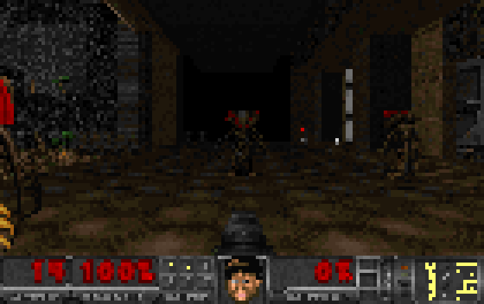
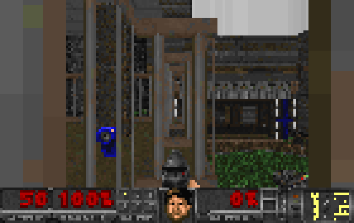
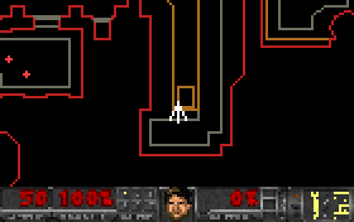

# TerminalDoom

Свой движок DOOM на Python, который читает **настоящие WAD-файлы** (IWAD/PWAD) и
играется прямо в терминале: true-color и полублоки `▀`, так что один символ — это
два пикселя по вертикали.

Никаких зависимостей: только стандартная библиотека Python.



*Терминал 140×44 символа. Имп в дверном проёме, дробовик в руках, настоящая
строка состояния DOOM.*

## Быстрый старт

Движок не содержит игровых данных — нужен любой WAD. Бесплатный вариант:
[Freedoom](https://freedoom.github.io/) (`freedoom1.wad` или `freedoom2.wad`),
подойдут и оригинальные `doom.wad` / `doom2.wad`.

```bash
python doom.py --wad путь/к/freedoom1.wad
```

```bash
python doom.py                      # первая карта из найденного WAD
python doom.py --map E1M3 --skill 4
python doom.py --wad doom2.wad --map MAP07
```

WAD ищется сам: переменная окружения `DOOMWAD`, папка
`Documents\freedoom-0.12.1`, затем любой `*.wad` рядом.

## Управление

| клавиша | действие |
|---|---|
| `W` `S` | вперёд / назад |
| `A` `D` или `←` `→` | поворот |
| `,` `.` | шаг вбок |
| `Shift` | бег |
| `E`, `Ctrl` или `F` | огонь |
| `Пробел` | открыть дверь, нажать переключатель |
| `1`…`7` | выбор оружия, `Z` / `X` — перебор |
| `Tab` или `M` | автокарта |
| `N` | следующая карта, `R` — начать заново |
| `G` | сквозь стены |
| `Esc` | выход |

Размер окна терминала — это и есть разрешение. На 120×40 символов (120×80
пикселей) выходит около 40–50 кадров в секунду. Чем больше окно, тем красивее и
медленнее.

## Что уже играется

- **Мир из WAD** — геометрия по дереву BSP, текстуры стен, флэты пола и потолка,
  небо, прозрачные средние текстуры (решётки и перила), освещение через родной
  `COLORMAP` (32 уровня), мигающие и разгорающиеся секторы, повреждающая слизь,
  тайники.
- **Монстры** — бывшие люди, сержанты, импы, демоны, спектры, какодемоны, души,
  бароны, кибердемон, паук; из DOOM 2 ещё пулемётчики, ревенанты, манкубусы,
  арахнотроны, элементали боли (выпускают души), архвайлы, эсэсовцы. У каждого
  свои здоровье, скорость, шанс боли, звуки, ближний бой или снаряды, анимации
  боли и смерти — включая разрыв на куски при переуроне.
- **Оружие** — кулак, пистолет, дробовик, двустволка, пулемёт, ракетница (со
  взрывом по площади), плазмомёт, BFG, бензопила. Настоящие спрайты рук, вспышка
  выстрела, покачивание при ходьбе, смена оружия с опусканием ствола.
- **Предметы** — аптечки, бонусы, броня, сферы, патроны, рюкзак, ключи, берсерк,
  костюм, неуязвимость.
- **Двери, лифты, полы, телепорты, двери под ключ, выход с уровня** и экран
  итогов: убито / предметы / тайники / время.
- **Строка состояния DOOM** — настоящий `STBAR` с большими цифрами, ячейками
  оружия, ключами и живым лицом морпеха, которое реагирует на урон и стрельбу.
- **Вспышки палитры** из `PLAYPAL`: красная при уроне, жёлтая при подборе,
  зелёная под костюмом.
- **Звук** — лампы `DS*` играются через `winsound` одним каналом с приоритетами
  (выстрелы важнее шагов монстров). Отключается `--nosound`.



*Средние текстуры двусторонних линий: сквозь прутья видно соседнюю комнату.*

## Что внутри

| файл | что делает |
|---|---|
| [dm/wad.py](dm/wad.py) | каталог лампов, `PLAYPAL`, `COLORMAP`, `PNAMES`, сборка составных текстур из патчей, флэты |
| [dm/mapdata.py](dm/mapdata.py) | `VERTEXES`, `LINEDEFS`, `SIDEDEFS`, `SECTORS`, `SEGS`, `SSECTORS`, `NODES`, `THINGS`, блокмап, трассировка лучей |
| [dm/renderer.py](dm/renderer.py) | обход BSP, стены по колонкам, полы/потолки, небо, решётки, спрайты |
| [dm/sprites.py](dm/sprites.py) | индекс `S_START..S_END`, повороты кадров, таблица типов вещей |
| [dm/things.py](dm/things.py) | характеристики монстров, снарядов и предметов |
| [dm/mobj.py](dm/mobj.py) | объекты мира: ИИ, атаки, урон, смерть, полёт снарядов |
| [dm/player.py](dm/player.py) | движение, оружие, боеприпасы, урон, палитра |
| [dm/game.py](dm/game.py) | мир целиком: спецлинии, двери, лифты, подбор, статистика |
| [dm/hud.py](dm/hud.py) | строка состояния, лицо, оружие в руках, экран итогов |
| [dm/term.py](dm/term.py) | VT-режим консоли, кадровый буфер, опрос клавиш |
| [dm/sound.py](dm/sound.py) | `DS*` → WAV → `winsound` |
| [dm/draw.py](dm/draw.py) | масштабирование патчей и кеш готовых растров |
| [dm/specials.py](dm/specials.py) | мигание света, повреждающий пол, тайники |

### Как это рисуется

Схема как у id Software: дерево BSP обходится от ближнего к дальнему, для
каждого сегмента считается перспективно корректная текстурная координата, а
массивы `top_clip`/`bot_clip` не дают дальней геометрии залезть на ближнюю.
Отличие одно: вместо visplane'ов пол и потолок заполняются прямо в колонке —
это законно, потому что внутри сектора высота пола постоянна, а границы
секторов в DOOM всегда проходят по настоящим линиям.

Спрайты и решётки рисуются после мира от дальних к ближним: для каждой колонки
хранится глубина закрывшей её стены и список окон отсечения, поэтому монстр за
краем портала обрезается правильно.

Чтобы всё это шло в реальном времени на Python, тяжёлые растры кешируются:
строка состояния перерисовывается только при смене показаний, кадры оружия
хранятся уже растянутыми и вклеиваются срезами массива. Монстры, как в
оригинале, шагают дискретно (раз в 0.1 с), а не каждый кадр, и ищут дорогу по
сетке твёрдых объектов.



## Проверка

```bash
python tools/mapsweep.py path/to/freedoom1.wad   # все карты: загрузка, логика, рендер
python tools/combat_test.py                      # бой, предметы, двери
python doom.py --selftest 200 --map E1M1         # прогон игрового цикла с ботом
python doom.py --bench 40 --size 120x40          # скорость рендера
python tools/shot.py E1M1 shot.png 320 200       # кадр в PNG
python tools/termshot.py E1M1 140 44 30 fire     # кадр в терминальном разрешении
```

`mapsweep` прогоняет все 36 карт `freedoom1.wad` и все 32 карты `freedoom2.wad`
без сбоев; то же самое гоняется в CI на свежескачанном Freedoom.

## Чего пока нет

- монстры не дерутся между собой (в оригинале задетый чужой ракетой монстр
  переключается на обидчика);
- нет музыки: лампы `MUS` не проигрываются;
- нет вертикального прицеливания и мыши — по вертикали работает автонаведение;
- звук только на Windows (`winsound`) и в один канал;
- из спецэффектов не сделаны лестницы, «пончики», раздавливающие потолки и
  воскрешение архвайлом.

## Лицензия и данные

Код — MIT, см. [LICENSE](LICENSE). В репозитории **нет игровых данных**: WAD не
входит в поставку и добавлен в `.gitignore`. Подробности про принадлежность
файлов DOOM и про Freedoom — в [NOTICE.md](NOTICE.md).

История версий — в [CHANGELOG.md](CHANGELOG.md).

---

**English.** A from-scratch DOOM engine in pure Python that reads real WAD files
and renders into a terminal with truecolor half-block characters. BSP traversal,
column-based texture mapping, `COLORMAP` lighting, transparent mid-textures,
sprites, monsters with AI, the full weapon set, the original status bar with the
marine's face, and sound from `DS*` lumps. No dependencies and no game data
included — bring your own WAD ([Freedoom](https://freedoom.github.io/) works):
`python doom.py --wad freedoom1.wad`. Controls: `W`/`S` move, `A`/`D` turn,
`,`/`.` strafe, `E` or `Ctrl` fire, `Space` opens doors, `Tab` automap, `Esc`
quits.
